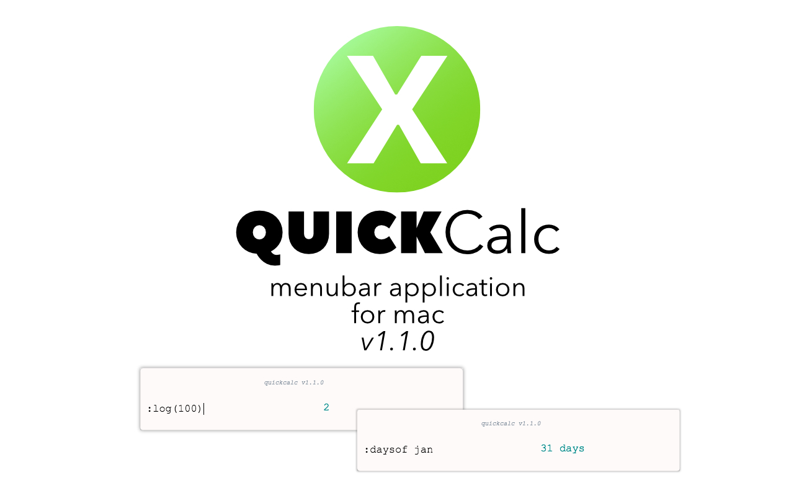

# quickcalc 
Simple Menu Bar Application For Mac and Windows

# 

## A Calculator That Does More 👍

## Functions To Help Your Daily Life ✅

## Let's Do Some Math ➗

## Install

*macOS 10.9+*, Windows now available!

### macOS

[**Download**](https://github.com/Cwoodall6/quickcalc/releases/download/v1.1.0/quickcalc.app.zip), unzip, and move `quickcalc.app` to the `/Applications` folder.

### Windows

[**Download**](https://github.com/Cwoodall6/quickcalc/releases/download/v1.1.0/quickcalc-win32-ia32.zip), unzip, and use `quickcalc.app`.

## Functions
### Math ➕
- Calculations can be simple or complex `5 + 4` `(4**3)/(4839-32+423)`
 * `+` plus
 * `-` minus
 * `*` multiply
 * `/` divide
 * `%` modulo
 * `**` exponent
- `:sqrt` returns square root ex. `:sqrt(4)`
- `:abs` returns absolute value ex. `:abs(4-7)`
- `:log` returns log (base 10) ex. `:log(100)`
- `:ln` returns natural log (base E) ex. `:ln(50)`
- `:e` returns e^x ex. `:e(2)`
- Trig functions are within code but aren't guarenteed to give a desired answer, so they aren't included in this list.

### Date and Time ⌚
- `:today` returns the current date; you may add or subtract days ex. `:today + 5`
- `:datein` returns the date plus the value you pass ex. `:datein 3`
- `:daysof` returns the amount of days in the value passed ex. `:daysof jan` `:daysof 3 years 5 months`
- `:time` returns current time

### Money 💸
- `:off` returns a percentage off of a value ex. `20% :off 300` `3% :off 50.50`
- `:of` returns percentage of a value ex. `50% :of 40` `16% :of 32.70`

### Misc. 🖥
- `:color` takes a Hex color code and displays a rectangle of inputed color ex. `:color(#000)`

## Shortcuts
- Quit: <kbd>command</kbd> + <kbd>Q</kbd>

## Future Iterations
 - [X] May Change UI
 - [X] More Keyboard Shortcuts
 - [X] Parenthesis
 - [ ] Auto Updater (IMPORTANT)
 - [ ] More Functions
 - [ ] Correct Trig functions
 - [ ] Dark Mode
 
## Ispiration and Thanks
- [Devin Rousso](http://devinrousso.com) Thanks for your guidance and help with getting me in the right direction. Go grab the [**GroupMe**](https://github.com/dcrousso/GroupMe#readme) client.

## License
MIT © [Chaz Woodall](https://chazwoodall.com)
